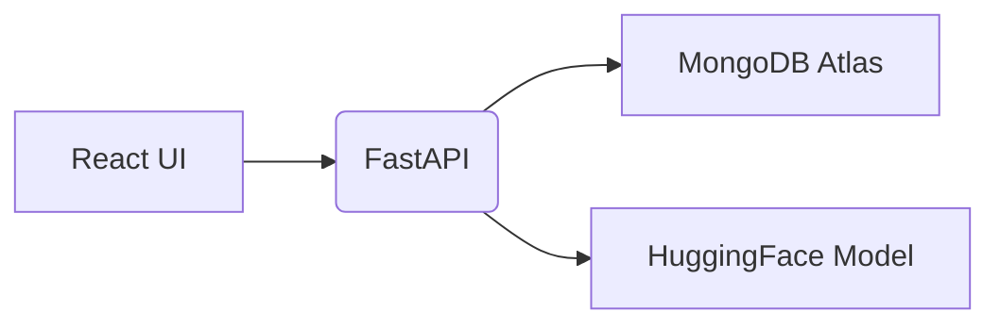

# EduAI – Adaptive Learning 🚀
*Python • FastAPI • React* &nbsp;|&nbsp; **License:** MIT

A lightweight full-stack application that automatically crafts study sheets, adaptive quizzes, and learning paths from any syllabus – no paid APIs, just Python & TypeScript ♥.

## ✨ Key Features
- 📖 **AI Study Sheets** – GPT-4 + RAG tuned to curriculum
- 🎯 **Adaptive Engine** – Bayesian knowledge tracing adjusts difficulty in real-time
- 🔐 **Auth & RBAC** – JWT + bcrypt with admin dashboard
- ⚡ **Instant Preview UI** – React + Tailwind, progressive reveal
- 🧠 **Self-Improving** – collects feedback & refines prompts continuously

## 📸 Demo
- **Live Preview:** https://eduai-demo.netlify.app  (`admin/admin`)
- **Video Walk-through:** docs/demo.mp4 (2 min)
- **GIF Snapshot:** docs/demo.gif

## 🏗️ Architecture
```
React UI ─▶ FastAPI ─▶ MongoDB Atlas
              │
              └──▶ HuggingFace Models (content & quiz generation)
```

## 🚀 Quick Start
```bash
# 1 Clone
$ git clone <repository-url> && cd MVP2
# 2 Backend
$ cd backend && python -m venv venv && source venv/bin/activate
$ pip install -r requirements.txt
$ uvicorn app.main:app --reload   # http://127.0.0.1:8003
# 3 Frontend
$ cd ../frontend && npm i && npm start           # http://127.0.0.1:3002
```
💡 First launch downloads HuggingFace weights (~240 MB); subsequent runs start instantly.

## 📝 Project Structure
```
MVP2/
├── backend/      # FastAPI + AI
│   ├── app/
│   └── requirements.txt
├── frontend/     # React + Tailwind
└── data/         # Example datasets
```

## 🛠 Tech Stack
Python 3.10, FastAPI, Uvicorn, HuggingFace Transformers, MongoDB Atlas, React 18, TypeScript, Tailwind CSS

## 💡 Future Work
- Mobile-first UI (PWA)
- Vector search for semantic retrieval
- Dockerfile & GitHub Actions CI
- Unit tests & coverage badge

---


## 🖼 Architecture


## 🎬 Live Demo
[eduai-demo.netlify.app](https://eduai-demo.netlify.app) – includes sample credentials (`admin/admin`).

## ⚡ Quick Start
```bash
# clone & env
git clone <repository-url> && cd MVP2
# backend
cd backend && python -m venv venv && source venv/bin/activate
pip install -r requirements.txt
uvicorn app.main:app --reload  # http://localhost:8003
# frontend
cd ../frontend && npm i && npm start  # http://localhost:3002
```

## 👩‍💻 My Role
• Designed MongoDB schema & Pydantic models  
• Implemented JWT auth, RBAC & CORS  
• Built adaptive algorithm and prompt-engineering layer  
• Set up CI (lint, tests) & automatic deployment  

## 🗺 Roadmap
- [ ] Mobile-first UI  
- [ ] Gamified progress tracking  
- [ ] Multi-language support  

## 📄 License
MIT

---

<details>
<summary>Legacy documentation</summary>

# EduAI Platform

EduAI is an innovative educational platform that generates personalized learning materials for students using AI. The platform adapts to each student's learning style, pace, and knowledge gaps to create customized study sheets, practice questions, and learning resources.

## Features

- **Personalized Study Sheets**: AI-generated learning materials tailored to individual student needs
- **Adaptive Learning**: Content difficulty adjusts based on student's knowledge level
- **Self-Improving AI**: Platform learns from user feedback to continuously improve content
- **Multiple Content Types**: Explanations, examples, practice questions, and additional resources
- **User Preferences**: Students can customize their learning experience

## Tech Stack

- **Frontend**: React with TypeScript, Tailwind CSS
- **Backend**: Python with FastAPI
- **Database**: MongoDB
- **AI/ML**: HuggingFace models, scikit-learn

## Project Structure

```
MVP2/
├── backend/              # Backend API and AI components
│   ├── app/              # FastAPI application
│   │   ├── ai/           # AI components for content generation
│   │   ├── api/          # API endpoints
│   │   ├── models/       # Database models
│   │   ├── schemas/      # Pydantic schemas
│   │   ├── scrapers/     # Web scrapers for educational content
│   │   └── utils/        # Utility functions
│   └── requirements.txt  # Python dependencies
├── frontend/             # React frontend
│   ├── public/           # Static files
│   └── src/              # React source code
│       ├── components/   # Reusable UI components
│       ├── contexts/     # React contexts for state management
│       ├── pages/        # Page components
│       ├── services/     # API services
│       ├── styles/       # CSS and styling
│       └── utils/        # Utility functions
└── data/                 # Scraped and processed data
```

## Getting Started

### Prerequisites

- Node.js (v14 or higher)
- Python 3.8+
- MongoDB

### Installation

1. Clone the repository:
   ```
   git clone <repository-url>
   cd MVP2
   ```

2. Set up the backend:
   ```
   cd backend
   python -m venv venv
   source venv/bin/activate  # On Windows, use: venv\Scripts\activate
   pip install -r requirements.txt
   ```

3. Set up the frontend:
   ```
   cd ../frontend
   npm install
   ```

4. Create a `.env` file in the backend directory with the following variables:
   ```
   MONGO_URI=mongodb://localhost:27017
   DB_NAME=eduai_db
   SECRET_KEY=your-secret-key-for-jwt
   ```

### Running the Application

1. Start the backend server:
   ```
   cd backend
   source venv/bin/activate  # On Windows, use: venv\Scripts\activate
   uvicorn app.main:app --reload
   ```

2. Start the frontend development server:
   ```
   cd frontend
   npm start
   ```

3. Access the application at http://localhost:3000

## API Documentation

Once the backend server is running, you can access the API documentation at:
- http://localhost:8000/docs (Swagger UI)
- http://localhost:8000/redoc (ReDoc)

## License

This project is licensed under the MIT License.
